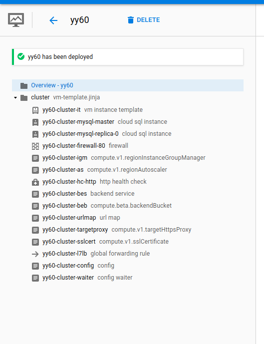
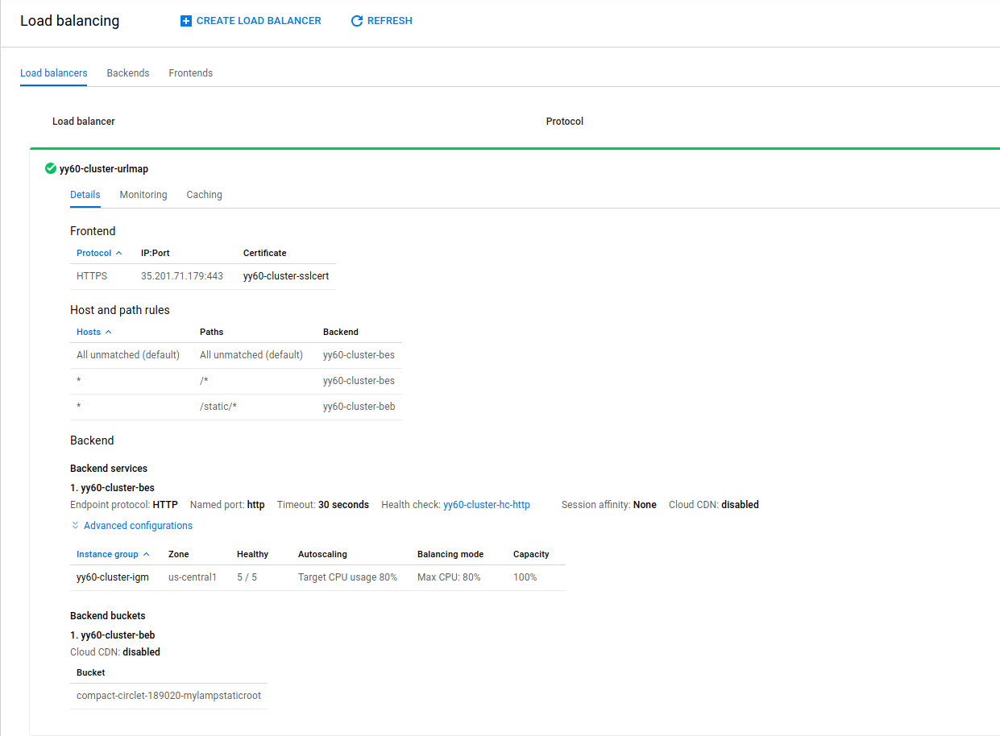
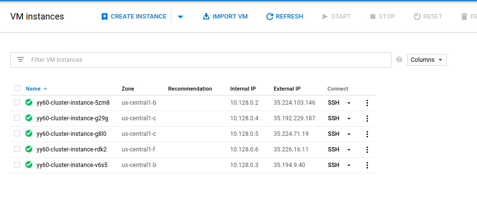
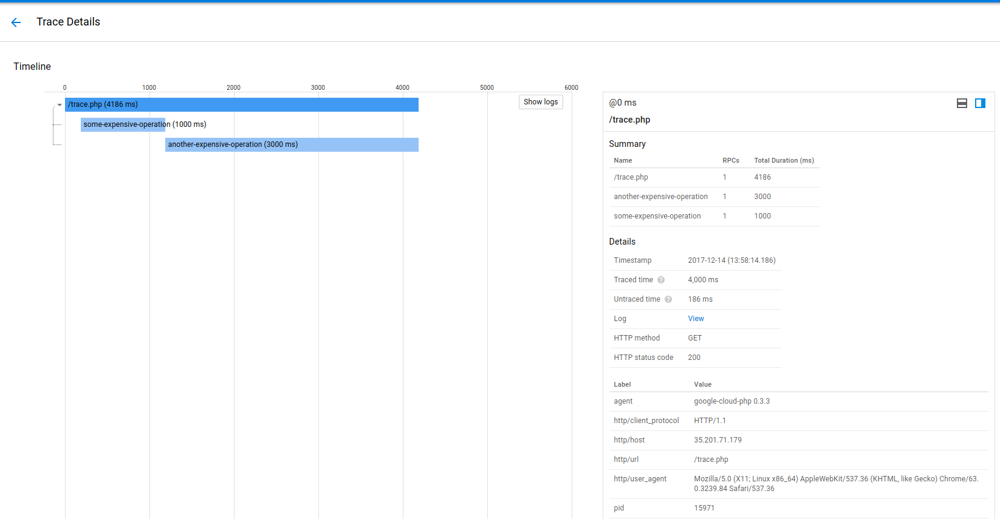
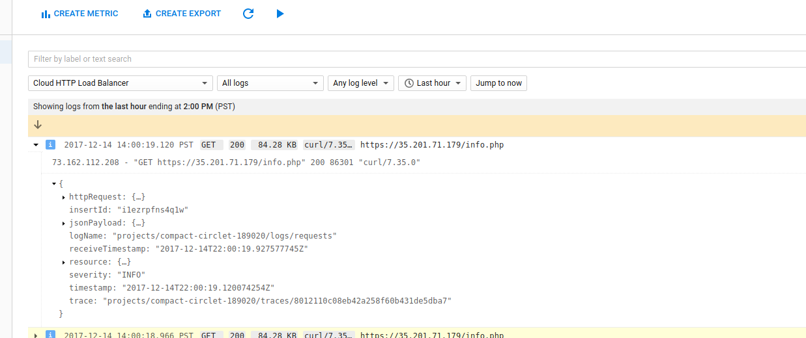
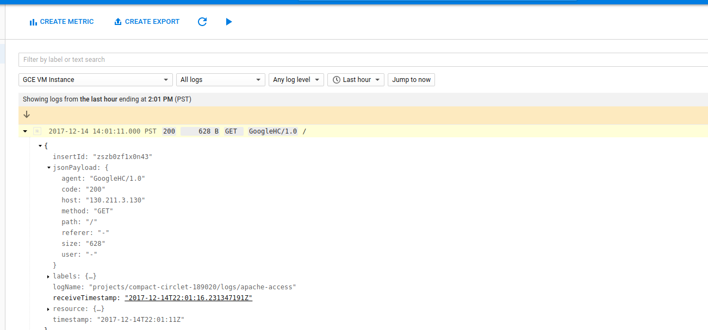
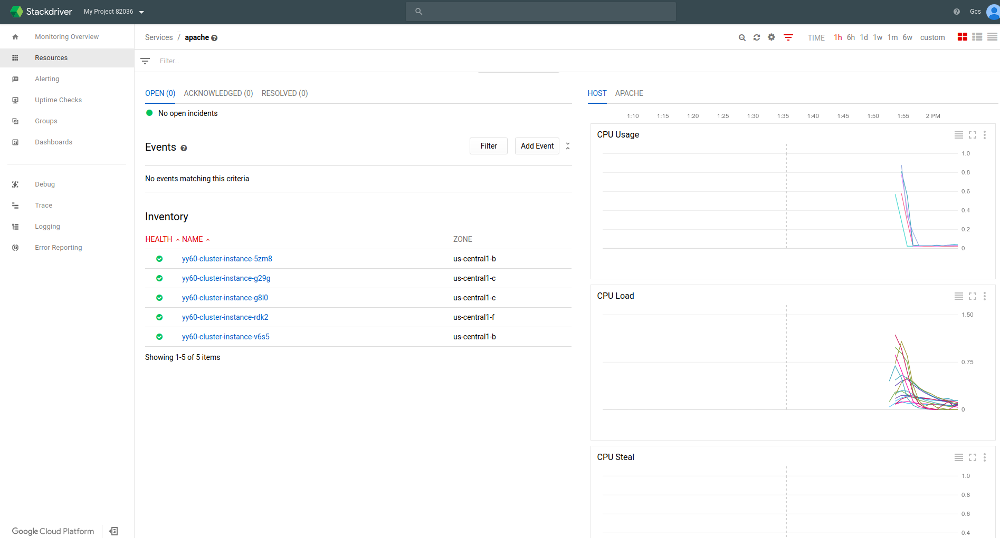
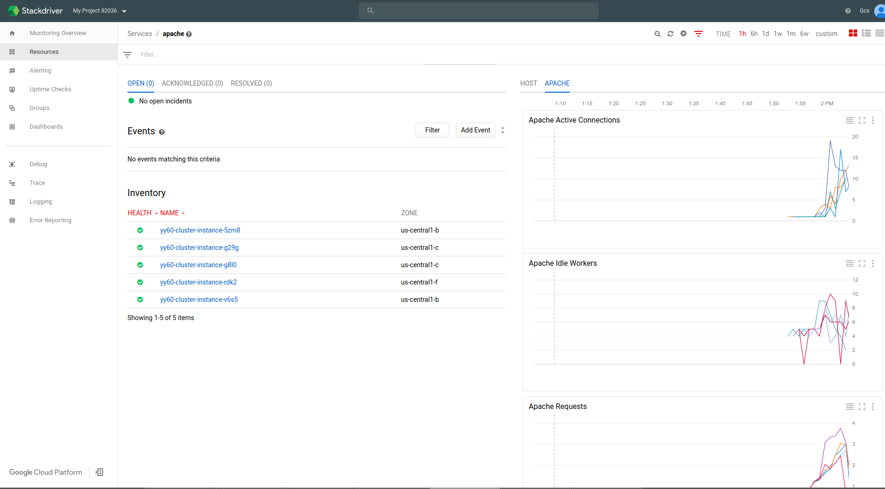
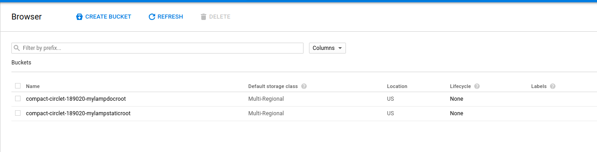

# High Availability LAMP on Google Cloud Platform

Sample high availability LAMP on GCP that demonstrates

- Global LoadBalancer
- SSL termination at LB
- [Regional Managed Instance Group](https://cloud.google.com/compute/docs/instance-groups/distributing-instances-with-regional-instance-groups)
- Autoscale Instance Group based on CPU usage
- Apache+PHP
- [Cloud SQL Master + N replicas](https://cloud.google.com/sql/docs/mysql/replication/)
- [Cloud SQL proxy](https://cloud.google.com/sql/docs/mysql/sql-proxy)
- [Stackdriver Logging](https://cloud.google.com/logging/) with apache plugin
- [Stackdriver Monitoring](https://cloud.google.com/monitoring/docs/) with apache plugin
- X-Forwarded-For IP address in Cloud Logging
- [Stackdriver Trace](https://cloud.google.com/trace/docs/) with custom spans
- [GCS Backend Bucket](https://cloud.google.com/compute/docs/load-balancing/http/adding-a-backend-bucket-to-content-based-load-balancing) as backend service for static content


This is a deployment manager script which demonstrates all the above in several 'easy' steps.

This is **NOT** intended to run in production but to give you a sample to demonstrate various HA capabilities of Google Compute Engine.  It
also features StackDriver monitoring and Logging as well as Cloud Trace.

> NB: i know very little PHP; i just happned to use that as language here for other reasons...

You can find a stand-alone example here that demonstrates the standard "BookShelf" set:
  - [https://github.com/GoogleCloudPlatform/getting-started-php](https://github.com/GoogleCloudPlatform/getting-started-php)


## Setup GCP Project

   You can use an existing project or create a new one with a $300 free trial.  You are welcome to delete the project or deployment
   entirely later on to clean up.

### Install gcloud

You will need to install and configure [Google Cloud SDK](https://cloud.google.com/sdk/downloads)

First list your project details to make sure this is the correct project
```
gcloud config list
```
### Enable Services 

This sample exercises the following APIs so run each

```
gcloud services enable storage-api.googleapis.com
gcloud services enable storage-component.googleapis.com
gcloud services enable compute.googleapis.com
gcloud services enable sql-component.googleapis.com
gcloud services enable sqladmin.googleapis.com
gcloud services enable cloudtrace.googleapis.com
gcloud services enable logging.googleapis.com
gcloud services enable monitoring.googleapis.com
gcloud services enable deploymentmanager.googleapis.com
gcloud services enable runtimeconfig.googleapis.com
```

### Set Environment Variables

Set the environment variables for the current project


```
export GCP_PROJECT=$(gcloud config get-value core/project)
export COMPUTE_SVC_ACCOUNT=$(gcloud iam service-accounts list --filter="displayName:'Compute Engine default service account'" --format='value(email)')
```

### Create 'docroot' GCS bucket

The following creates the docroot where you will upload some .php files.

During runtime, the startup script will download the php files from this bucket.

```
gsutil mb gs://$GCP_PROJECT-mylampdocroot
gsutil cp docroot/* gs://$GCP_PROJECT-mylampdocroot
gsutil iam ch serviceAccount:$COMPUTE_SVC_ACCOUNT:objectAdmin gs://$GCP_PROJECT-mylampdocroot
```
There are many, many better variations here...you do not have to use GCS...you can use Google Cloud [Source Repository](https://cloud.google.com/source-repositories/), github, and so on.  I ended up using this to simplify. 


### Create static content GCS bucket

This bucket hosts the static content (images, css, .j).  The 

/staic/* path will be automatically get fetched from GCS so the request never hits the webserver.

```
gsutil mb gs://$GCP_PROJECT-mylampstaticroot
gsutil cp static/google-cloud.png gs://$GCP_PROJECT-mylampstaticroot/static/google-cloud.png
gsutil acl ch -u AllUsers:R gs://$GCP_PROJECT-mylampstaticroot/static/google-cloud.png
```

---


### Determine Bucket Env Variables

Get the bucket names to setup for the config files


```
echo $GCP_PROJECT-mylampdocroot
echo $GCP_PROJECT-mylampstaticroot
```

### Edit cluster.yaml

Edit cluster.yaml

change to:
      staticBucket: your-project-here-mylampstaticroot 
      docrootBucket: your-project-here-mylampdocroot

(ofcourse, use your project number as shown agove )
---


## Run Deployment Manager script

The following may take 10mins
```
$ gcloud deployment-manager deployments create yy60 --config cluster.yaml
NAME                          TYPE                                   STATE      ERRORS  INTENT
yy60-cluster-as               compute.v1.regionAutoscaler            COMPLETED  []
yy60-cluster-beb              compute.beta.backendBucket             COMPLETED  []
yy60-cluster-bes              compute.v1.backendService              COMPLETED  []
yy60-cluster-config           runtimeconfig.v1beta1.config           COMPLETED  []
yy60-cluster-firewall-80      compute.v1.firewall                    COMPLETED  []
yy60-cluster-hc-http          compute.v1.httpHealthCheck             COMPLETED  []
yy60-cluster-igm              compute.v1.regionInstanceGroupManager  COMPLETED  []
yy60-cluster-it               compute.v1.instanceTemplate            COMPLETED  []
yy60-cluster-l7lb             compute.v1.globalForwardingRule        COMPLETED  []
yy60-cluster-mysql-master     sqladmin.v1beta4.instance              COMPLETED  []
yy60-cluster-mysql-replica-0  sqladmin.v1beta4.instance              COMPLETED  []
yy60-cluster-sslcert          compute.v1.sslCertificate              COMPLETED  []
yy60-cluster-targetproxy      compute.v1.targetHttpsProxy            COMPLETED  []
yy60-cluster-urlmap           compute.v1.urlMap                      COMPLETED  []
yy60-cluster-waiter           runtimeconfig.v1beta1.waiter           COMPLETED  []
```

You can find the progress here with Deployment Manager section of GCP
- [https://console.cloud.google.com/deployments/details/](https://console.cloud.google.com/deployments/details/)

Once complete, you should see:




## Verify

### Acquire the Global LB IP:

Goto "Network Services >> Load Balancing" and note down the IP address:




In the case above, its ```35.190.80.170```


Also note that
- /static/* is served by a backend bucket
- VMs are in us-central1  (regional)
- SSL certificate was assigned to the LB

### Verify VMs are all up in the group

You can verify that the requsite VM count is up and running and spread across zones for HA:




Note that the VMs are across availability zones


### Verify Endpoints:

Now we can check each endpoint to see them working.

#### Send traffic to the LB group:

     ```
     for i in {1..1000}; do curl -k -o /dev/null -s -w "%{http_code}\n" https://35.190.80.170/productpage; done
     ```

#### Verify CloudSQL

Open a browser and goto ```https://GlobalIP/db.php

You shouldsee the following text which denotes a successful connection from PHP to both the master and replica count you setup
```
Localhost via UNIX socket
5.7.14-google-log to yy60-cluster-mysql-master 
Localhost via UNIX socket
5.7.14-google to yy60-cluster-mysql-replica-0 
```

#### Verify Cloud Trace

Open a browser and goto ```https://GlobalIP/trace.php```

You should see the text similar to the bit below
```
done span 1
done span2

Trace successful
```

Doesn't look like much but on the Cloud Console, goto "Cloud Trace" to see:




What that shows is cloud trace loaded and two spans emitted.


#### Verify Logs

You can see the Loadbalancer logs by going to Cloud Logging--> LoadBalancer



Then to go see the apache logs, see:




Note, the apache configuration accounts for _X-Forwarded-For_ Header in the apache configuration file:

```
SetEnvIf X-Forwarded-For "^.*\..*\..*\..*" forwarded
LogFormat "%h %l %u %t \"%r\" %>s %b \"%{Referer}i\" \"%{User-Agent}i\"" combined
LogFormat "%{X-Forwarded-For}i %l %u %t \"%r\" %>s %b \"%{Referer}i\" \"%{User-Agent}i\"" forwarded
```

Which means the actual orgin IP address of the browser is sent through to apache.


The Apache FluentD plugin is disabled at the moment because it cannot process structured exports.
That is, the following is commented out for now:
```
#sed -i 's/format none/format apache/' /etc/google-fluentd/config.d/apache.conf
```
(for reference, see [issue#10](https://github.com/GoogleCloudPlatform/fluentd-catch-all-config/issues/10))


#### Verify Cloud Monitoring

The sample DM script installs and configures not only Stackdriver, but the Apache Plugin as well for Stackdriver.

What that means is you will see both the default Host Metrics:



but also the Apache specific metrics



#### Verify Static GCS Serving

Goto ``https://GlobalIP/static/google-cloud.php```

You should see a simple logo.  This being served directly from a GCS Bucket:



